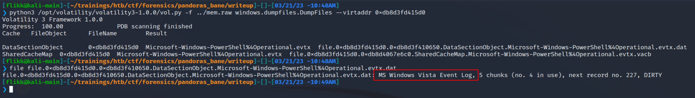

# Overview
I participated in the HackTheBox Cyber Apocalypse 2023 CTF this year and there were some pretty interesting challenges, so I figured why not create a few write-ups for some of my favorites.

The first was called "Pandora's Bane" and was a forensics challenge rated as insane difficulty.  The description of the challenge is below.

```
Having now the relic, Pandora is trying to create a plan to shut down the vessels. Unfortunately for her, the alien's intel is one step ahead, as they somehow know what she is up to. An incident response operation started as Pandora was sure the aliens had gained access to her teammate's host. Although many compromised hosts were found, only one sample is applicable for further analysis. If you neutralize this threat by analyzing the sample, Pandora will be able to proceed with her plan.
```

There was no interactive instance for this challenge, just some files to download.  In this case, a single 2gb memory dump.


# Initial Inspection with Volatility
I've written a post before about using [Volatility](https://www.volatilityfoundation.org/) to parse memory dumps, so this process will be similar, but using the newer version 3 instead of 2 as I had issues finding a valid profile that worked with version 2.  I want to say up front that my investigative process is by no means the best and is probably very inefficient, but it works for me.

One difference I noticed in version 3 is that you apparently don't need to provide a profile to be able to run the plugins, or at least I didn't.  Either way, we can get started by gathering some basic information about the image itself using the `windows.info.Info` command.  The screenshot below shows Volatility has identified the dump is coming from a machine that appears to be running Windows 10 19041, which according to [Wikipedia](https://en.wikipedia.org/wiki/Windows_10_version_history) corresponds to the May 2020 update or 20H1.  That doesn't help very much right now for the challenge, but it's good to know just in case.


My next step is usually to run the `windows.pstree.PsTree` command to get an output of all processes that were running at the time the dump was collected formatted into a tree showing parent/child relationships.


Most of the information above was removed for brevity, but of interest to us are several lines near the bottom related to the Windows Subsystem for Linux (or WSL), a parent-less bash process, and the active powershell.exe process.  WSL has been known to be used by threat actors as a way to "fly under the radar" of regular security tools.  Here are a few articles discussing it for anyone interested.

- https://www.bleepingcomputer.com/news/security/new-windows-subsystem-for-linux-malware-steals-browser-auth-cookies/
- https://blog.lumen.com/windows-subsystem-for-linux-wsl-threats/


# Investigating suspicious WSL usage
There are a few ways to look further into the WSL vector, but I chose to use the `windows.filescan.FileScan` command to get a list of every file identified in the dump.  This will help us because the WSL file system usually shows up under the profile for whichever user installed it, which means we may be able to view some of the Linux files that were used and determine whether they're malicious or not.  This command generally produces a lot of output, so I pipe it to a file and search through for anything interesting.  Below is an example of what it looks like and near the top we already see an indication that there are files related to the Ubuntu subsystem's file system.


Knowing this file system exists, seemingly all under the same folder, I can do a few quick regex searches in Sublime Text for only lines in these folders.  In this case, the search was something simple like `.*CanonicalGroupLimited.Ubuntu.*`.  This gives me anything related to WSL, but I want to narrow the search further and look for anything in the /home directory to potentially see if a bash_history file exists for a user that we can then dump and read.


As we can see in the image above, this gives a list of only 10 files, all within the /home/user directory, two of which are the .bash_history file (though I suspect this is just a duplicate).  Using the virtual address at the beginning of these lines, we can use the `windows.dumpfiles.DumpFiles` command to carve out individual files from the dump and inspect their contents.


Using this command we 1) successfully dump the .bash_history file and 2) read the contents to confirm it was dumped with content intact.  Looking at the contents of the file it seems like basic Linux recon until we get to the line using wget.  This command appears to download something from hxxp://windowsliveupdater[.]com/updater and save it to a file at /tmp/.apt-cache, where it is later executed.  This is pretty suspicious on its own with the file being saved to /tmp as a hidden file (prepending a file with . in Linux hides it unless using something like `ls -a` to show all files).  However, I was curious and threw the URL into VirusTotal to see if it actually existed at some point.  The next image shows it did, but it was first seen around the same time the CTF started, so the associated scans were likely related to this challenge.


I also wanted to see if the file still existed, so I browsed to the link (in an isolated VM of course) and was immediately re-directed to hxxp://makeloris[.]com, which then re-directed to a rick roll on Youtube, so kudos to the challenge creator for that.

Going back to the list of files we found earlier, I searched through one more time for the name of the file we saw above (.apt-cache), and it still existed in the dump.


# Looking into the suspicious downloaded executable
Using the same command as before, we can extract this file and see it is identified as an x64 ELF file, or Linux executable.  It's also a pretty large file at ~4mb.


Running strings against the file gives around 28k lines of output, so it's a considerable amount of text to sort through.  When scrolling through the list at a quick glance, some sections immediately stand out as being a little more interesting than others.


Dissecting the content above we see three main things: 

1) A reference to rustc and a navigate.rs file indicating the file could have been written in Rust.
2) A PowerShell command appears to be being setup with a potential HTTP request to hxxp://windowsliveupdater[.]com/updaterId
3) More PowerShell that appears to be loading an assembly into memory and running it with the namespace SecurityUpdate.Updater

With these things in mind, we're getting closer to understanding what the attacker may be doing.  So far we've seen the use of WSL to download a payload from an external site that has references to PowerShell commands being run, but we haven't seen the actual command that was executed yet.  The next step int he investigation would usually be to look closer at the executable to see what other information it contains, potentially figuring out more about what its purpose is.

There are a variety of tools that can be used to do this, such as Ghidra or IDA Pro, but I chose to use the trial version of [BinaryNinja](https://binary.ninja/) because I just like it's interface a little better.  After downloading the binary and starting up the application we can load in the extracted .apt-cache file and the tool will automatically start analyzing it to parse out as much useful information as it can.  However, the presentation can be a bit overwhelming at first as we're shown a lot right away as seen in the image below.  Scrolling through the "Symbols" section, which is a listing of functions identified in the app, shows us to interesting items: rust_loader::main::he1dbe5ec8f35a907 and main.  This more or less confirms this binary was written in Rust and gives us a great place to start our analysis as the main function is where the execution would begin.


Double-clicking the main function takes us to the generated decompiled code for this function.  It should be mentioned that the decompiled code is just the best guess on the part of the tool and not 100% accurate to the original, which is often times a great reason to try multiple tools to see if they decompile the code differently.  The website [Dogbolt](https://dogbolt.org/) is actually very useful for this as you can upload a file and see the decompiled code from multiple tools, though it does have a 2mb file size limit so we can't use it in this case.


This function is pretty short and seems to only serve to call the function rust_loader::main::he1dbe5ec8f35a907, which is seen below and is much larger.  Right away we see string references to a PowerShell command that seems to be in the same format as what we saw in the strings output earlier.  I'm not going to go 


Double-clicking the string on the second line above takes us to the section of memory where the string itself is stored.  This shows us several other strings stored in the same area, but still does not give us the full command being run by PowerShell.


I spent a good amount of time poking through the rest of the application in both BinaryNinja and Ghidra, but wasn't able to find anymore information on the actual command executed.  My best guess is that the actual command was downloaded by the request to /updateId (which is no longer online), but it's also possible I missed it somewhere in the analysis.  Either way, I pivoted to a different tactic to move forward.

# Identifying the malicious PowerShell commands
At this point we should be fairly confident something malicious is going on and that there was a PowerShell command being executed by this Rust application.  I figured this in a regular environment there would likely be PowerShell logging enabled, which means the commands would be saved to an Event Log with the details on what was run.  I went back to the list of files one more time and searched for .evtx files (the extension for Windows Event Logs) and found around 100 hits.  The one I was most interested in was the entry for "Microsoft-Windows-PowerShell%4Operational" as this likely indicates PowerShell logging is turned on.


Extracting the file using the same method as before shows we successfully get what is identified as a Windows Event Log.



To make the process easier, I moved the log over to a Windows VM so I could simply open and view the events.  Once the log was opened, I scrolled to the very bottom and started moving up until I found an entry for event ID 4104, "Execute a Remote Command", which we see below contains a large Base64 encoded string.


Copying out this entire command and disabling word wrap shows this matches the same format seen earlier where the Base64 string is eventually loaded as an assembly named "SecurityUpdate.Updater" and run in memory.


I then took the Base64-encoded string and used [CyberChef](https://gchq.github.io/CyberChef/) to decode it.  As seen below, the decoded content begins with the MZ header and the usual "This program cannot be run..." message indicating it is an executable.


I downloaded this file and named it "Updater.dll" to match the namespace seen above and we can see it is identified as a 32-bit .NET DLL.  The fact that it was written in .NET means we should be able to decompile the application in a tool like [dnSpy](https://github.com/dnSpy/dnSpy) or [ILSpy](https://github.com/icsharpcode/ILSpy).


# Digging into the DLL 
Moving the file back to my Windows machine with dnSpy downloaded allows me to open it up successfully.  We can also see that once decompiled we get the original source code matching the SecurityUpdate namespace and Updater class already identified.


The application itself is not very long and the "Run" function, which contains most of the functionality, can be seen below.


There are 4 main steps happening in this function.

1) WMI is used to get information about the computer, seemingly to identify if there are any references to having been run in a virtual machine as an anti-VM technique .  If there are, the flag variable is set to "True".
2) If a VM was detected, the rest of the code doesn't run and just simply finishes/exits.
3) If a VM was not detected, the contents of a byte array defined later in the app is XOR'd against specific characters in another array named key to decrypt the hard-coded payload into what will actually be executed in step 4.
4) Memory is supposed to be allocated for the shellcode byte array and executed when the "shellcodeDelegate()" function is called, though this portion of the code doesn't seem to exist in the DLL I examined.

This seems to be a pretty standard method of shellcode injection, so our next goal is figuring out what the shellcode itself is supposed to do.  I'm lazy whenever I can be, so I took the easy route and copied the entire program over into my own C# project in Visual Studio to tweak.  My modified version can be seen below.


There are only a few key changes to the program:

1) I added a Main() function that simply calls Run so my console application will compile and run correctly.
2) I hardcoded the flag3 variable to false so the rest of the code will always execute, regardless of whether it's in a VM or not.
3) I commented out the injection portion and added a line to save the decrypted shellcode to a file.  I chose to make it a DLL because I assumed that's what it would be, but the extension doesn't really matter at this stage.

Running strings against the final output file shows the flag as part of a command to add a new user.

