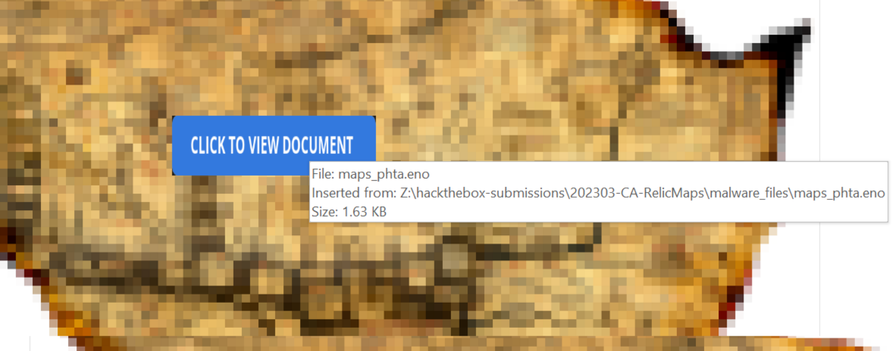

# Overview
A second forensics challenge in the recent HackTheBox CTF was called "Relic Maps" and was a forensics challenge rated as medium difficulty.  This one was pretty interesting given the recent attention around attackers weaponizing OneNote files.  The description of the challenge is below.

> Pandora received an email with a link claiming to have information about the location of the relic and attached ancient city maps, but something seems off about it. Could it be rivals trying to send her off on a distraction? Or worse, could they be trying to hack her systems to get what she knows?Investigate the given attachment and figure out what's going on and get the flag. The link is to hxxp://relicmaps[.]htb/relicmaps.one. The document is still live (relicmaps.htb should resolve to your docker instance).

This challenge did not provide any files to download, but allowed us to spawn a docker instance to interact with and mentions the relicmaps[.]htb domain mention in the description should resolve to the docker address.

# Initial Recon of web page
Browsing to the IP of our docker instance just gives a generic "Not Found" page, but does respond indicating the server appears to be up.

Next, we can check the URL listed in the description at /relicmaps.one.  As seen below, this responds with a download for the file "relicmaps.one".  

Inspecting the file in Linux doesn't tell us the format is "OneNote" or anything like that, it just shows as generic data, but looking at the content it is clearly binary information we can't read.  However, there are some references to an HTA file that may be of some interest.  The .one extension is associated with the files created for each tab in a OneNote notebook, so we may be able to inspect it further through that application.

As I'm lucky enough to have some extra installations of Office in test VMs, I moved the file over to one running [FlareVM](https://github.com/mandiant/flare-vm) for further analysis.  Opening the file from there shows us it appears to be a single OneNote section named "relicmaps" with the "Classified Maps" header and a blurred out image.  

For items embedded in OneNote, like what appears to be in this case, hovering over the files/button displays the file path of where they were originally uploaded from.  In some cases this may leak a username or other sensitive information, but here it just shows it is related to the HackTheBox challenges.

Of more interest to us, the button itself seems to be a different object than what is embedded underneath and can be dragged to a different section of the page to reveal the actual embedded files.  There appear to be 3 files with the same name in order to take up the entire space under the button, so one would be selected regardless of where someone clicked on the button itself.  This has been a pretty popular attack vector recently for real-world threat actors and pentesters alike.  One article discussing this is linked below for reference.

- https://www.bleepingcomputer.com/news/security/emotet-malware-now-distributed-in-microsoft-onenote-files-to-evade-defenses/

Moving on with the challenge, selecting/hovering/right-clicking the items in the section don't tell us what type of files these are, but double-clicking would execute them nonetheless (after 1 or 2 warning prompts).  My OneNote did not allow me to right-click and save-as for the file, so the easiest method I could find was to simply right-click the file and choose copy.  I then went to another folder on the file system and pasted it, which gave us the HTA file below named `maps_path.one`.  The extension this time is a little deceptive as this is not another OneNote section, but instead an HTML Application (HTA) as seen by the Type column or file details below.

HTML file are generally just plain-text, so opening it in a text editor lets us see what code would have been executed has a user run it from the OneNote section.  This particular HTA appears to be using VBScript to call PowerShell and download two more files from the same relicmaps.htb domain to save to the user's temp directory then execute them with Start-Process.  The $env:tmp PowerShell variable used in the code below resolves to `C:\Users\USERNAME\AppData\Local\Temp`, so the two files below would be created and run automatically.

- `/uploads/soft/topsecret-maps.one`   >>   `C:\Users\USERNAME\AppData\Local\Temp\tsmap.one`
- `/get/DdAbds/window.bat`   >>   `C:\Users\USERNAME\AppData\Local\Temp\system32.bat`

Going back to the active site and visiting these two URLs show us both still exist.  The first 1) topsecret-maps.one automatically downloads and 2) window.bat displays what appears to be random strings in a Windows batch file.

The first file, topsecret-maps.one, just opens a new OneNote section with an unblurred version of the first image, likely to avoid the target user suspecting anything suspicious and continue thinking the button they clicked worked as intended.

The second file, window.bat, is much more interesting (and seemingly malicious).  As seen below, there are 375 lines of text in the file, 371 of which are seem to be 1) building a number of environment variables out of sliced up strings.  The variables are then 2) combined together to form the original strings that will be executed by the batch file.

There are a number of ways to go about extracting the actual final commands being run, but I chose to do it the semi-lazy way and let Windows do most of the work for me (again in a sandboxed VM, just in case).  I copied/pasted everything up to line 371 above into a command prompt to set all of the appropriate environment variables and then just used `echo` to print out the final combined strings.  The first two (lines 372 and 374) appear to be making a copy of the real powershell.exe into a new file with a similar name to the .bat and then changing directories into where the .bat was executed from.  The file names seen below are strange because I ran this directly in the command prompt, but when run from a modified .bat file it uses the current file name and directory.  This can be seen in the second image where I copied the same commands into a new file and executed it.

Adding in the last large section on line 375 gives us the final PowerShell command that is executed using the newly created copy of powershell.exe. 

This section of code is doing a few interesting things, but I copied the actual PowerShell portion into Notepad and split it onto new lines fore very semi-colon for better readability.

1) The script reads the content of the window.bat file in, looks for a specific line beginning with ":: ", and loads the content after those first 3 characters into a new variable.
2) Lines 8-15 are converting the loaded string from Base64 and doing some things with AES crypto to seemingly decrypt the content to it's intended state.
3) Lines 25-28 are converting the data to a byte array and reflectively loading it in memory as an assembly (DLL), where it is finally executed on line 29 by the Invoke call.

As this script seems to hold everything needed to decode and execute the next payload, I again took the lazy route and let PowerShell do it for me.  I made the modifications below to save the byte array created on line 20 to a file named `payload.dll` and commented out the rest that was intended to execute the assembly.

Running the script does not produce any errors and seems to create a new file with the name we specified.  Using the "Detect it Easy" tool in FlareVM against it we can see it appears to be recognized as a valid .NET console application.

As with other .NET applications, we can open it in a tool like dnSpy to get the decompiled version of the original code.  When doing this here and viewing the Program class we see the flag as one of the variables.

Though not needed for the challenge, taking a closer look at the application shows it seems to be gathering information from the local machine and sending it back to the C2 server.

1) Collects basic machine info like IP, computer name, and username
2) Encrypts the data
3) Makes a POST request to hxxp://relicmaps[.]htb/callback with the encrypted machine data

