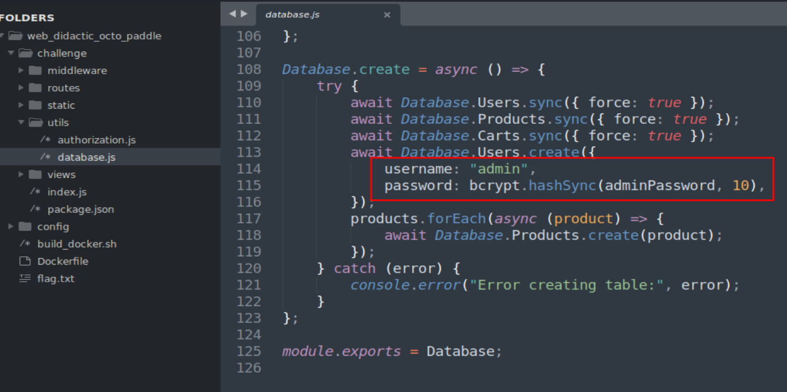

# Overview
The challenge "Didactic Octo Paddles" was another web challenge in the HTB Cyber Apocalypse CTF rated as medium difficulty.

```
You have been hired by the Intergalactic Ministry of Spies to retrieve a powerful relic that is believed to be hidden within the small paddle shop, by the river. You must hack into the paddle shop's system to obtain information on the relic's location. Your ultimate challenge is to shut down the parasitic alien vessels and save humanity from certain destruction by retrieving the relic hidden within the Didactic Octo Paddles shop.
```

This one provides both a docker instance we need to start and a download for the source code of the target web application.  The structure of the web app files is seen below and the Dockerfile appears to indicate it is a NodeJS application and that the flag has been stored at /flag.txt.


# Initial Web App Recon
Browsing to the IP provided us for the docker instance redirects to /login and gives a generic login screen as seen below.


We can try a few guesses at default credentials like admin:admin, but it doesn't work and only provides a generic error of "Invalid username or password".  We can actually see where the admin user's credentials are created in the source code, specifically in the utils/database.js file.



The "adminPassword" variable seen above is created in the authorization.js file in the same directory.  It appears to be creating a random 32 character hex string when the app is spun up, so we're not likely to just guess it.  We'll need to move on for now.


NodeJS applications generally include a file that defines all of the URL endpoints it should respond to and what actions to take when they are visited.  The standard usually having a folder named "routes" that has a file containing this code.  In this case, the files routes/index.js appears to serve this function and can be seen below with a few examples where it is defining the / and /register URIs.  It's also interesting because some of these endpoints have middleware functions defined as well which are intended to take some kind of action on the request before the code defined in the route.  In the image below this can be seen with the "AuthMiddleware" function, but we'll circle back to that later.


To save some time, we can get an overall list of defined endpoints by searching the entire file (or folder containing source code) for the following regex pattern: `router\.[get|post]` and see all of the entries in the screenshot below.  This gives us a nice list to start working from, especially as we now know there appears to be a /register endpoint even though the initial login page did not have an option to do so.  It also shows us which paths have an additional middleware functions applied to them.  I've listed them below for reference.

- **AuthMiddleware**
	- /
	- /cart
	- /add-to-cart/:item
	- /remove-from-cart/:item
- **AdminMiddleware**
	- /admin


Trying to browse to any of the endpoints with the callback functions just redirects us back to the the login, so it looks like we need to create an account before going further.  Browsing to /register gives us the form below and lets us successfully create a new account.


If we take our newly registered account and try the main /login page again we are able to log in successfully, to then be re-directed to what seems to be an online shop of some kind.


Now that we're logged in, I tried browsing back to the other pages found earlier.  The /cart path just displays a message about our cart being empty and /admin gives the mostly blank message below letting us know that we are not an admin.  This second message was interesting because the app is somehow able to tell we are not an admin, but we're not sure how it is determining that yet.


Opening up the Firefox Dev Tools shows we were assigned a cookie named "session" that appears to hold a JWT (JSON Web Token).  We can confirm this by visiting a site like [jwt.io](https://jwt.io/) and have it parse the value of our session cookie.


This shows that our cookie is a valid JWT and defines several pieces of standard information used for user sessions, notably the "id" field that is likely being used to determine if we are an admin.  Going back to the AdminMiddleware.js file mentioned earlier, we can see the logic applied to any user that visits the /admin path.  This shows the logic used by the app and how the JWT is incorporated into the checks.


To summarize, there are 4 main parts of this function.

1) The JWT is extracted from the session cookie included in the HTTP request and decoded to get the stored data
2) If the JWT algorithm field is set to "none", the user is redirected to /login.  This is intended to prevent users from attempting to modify their tokens, but in this case seems to be case-sensitive.  If we change the capitilization of "none" being used, it should skip over this check.
3) If the algorithm is set to HS256, additional checks are performed to see if the ID in the JWT matches what has been stored for the admin.  If not, we get the "You are not an admin" message already seen.
4) In any other case, the same verification steps are performed on the JWT, but with one major difference.  The token used to sign the JWT is not included in the verify function here, meaning a modified token could be accepted if this branch could be reached.

The next image is an extract of lines 16 and 27 above to show the differences in the function calls.  Essentially, the else branch does not use the original JWT secret token to verify the session cookie, meaning it can be modified and likely accepted by the application.  Combined with the lack of case-insensitive checking for the word "none" on line 13, we should be able to get to the else branch with a few modifications.


We can test this theory by viewing one of our requests to /admin in Burp Suite's Repeater.  There are multiple ways to do this, but I'm going to use the JWT Editor Burp extension that can be found in the BApp store.  Below we see the request using the regular session cookie we were assigned by the application and the expected "You are not an admin" message.


Clicking into the "JSON Web Token" tab shows us the decoded values of our current token, matching what we saw earlier.


We could manually edit the token by changing "alg" to "None" (or nOne, nonE, etc.) and removing the signature portion of the token (any characters after the second period)., but the extension has an option to make this type of attack easier.


Once we click the Attack button and the option seen above, our token is automatically modified to include the none algorithm and have the signature portion removed, as seen below.


Now, we just need to change the casing on the algorithm and change id to 1 and we should see a successful request to the /admin endpoint.


We've successfully bypassed the JWT check and can now view the admin dashboard.  The dashboard itself doesn't seem to do much except display a list of currently registered users.


Going back to the routes/index.js file to see how this endpoint is defined, we see a short section of code that appears to just retrieve all users from the database and use jsrender to display them to the page through a template.  Templating engines like jsrender are intended to save developers time and avoid needing to create entirely new pages for everything they need when they can use a template and just pass in information to be populated.  However, if the information being rendered is not properly sanitized it can lead to vulnerabilities, including remote code execution in some cases.  This seems to be the case here as the "usernames" variable is passed directly into the render function.


The views/admin.jsrender file below gives an example of what the template files look like.  Anything in double brackets ( i.e. {{ example }} ) is an indication of what should be replaced by data passed into the template to be rendered.


As for how we can exploit this, I've found [HackTricks](https://book.hacktricks.xyz/pentesting-web/ssti-server-side-template-injection) to be useful for the various types of payloads that can be used, but there are likely a number of other sites/articles that can be helpful as well.  Choosing the "JsRender" bullet on the right side takes us to the relevant section with some example payloads we can try.  The server side example seen below is the one I used as it uses the nodejs function child_process to execute a system command on the underlying server.


For our app, we need to get the payload into the username valid of a registered account, which means we need to circle back to the /register endpoint and submit a new request with the payload inserted as seen below.  For the first test I'm using their default payload of `cat /etc/passwd` as that file should always exist, though note we need to escape any double-quotes used in the command to avoid causing any syntax errors.


Submitting the above request appears to be successful as we receive the message about our new user having been registered.  If we go back and try to request the /admin page one more time with our modified token, we see the same 2 users listed like before, but with the additional content of /etc/passwd displayed as well, confirming we have code execution.


The original Dockerfile we were provided shows the flag was copied to /flag.txt, so we just need to go back and register one more user and change the command executed to be `cat /flag.txt`.  After doing this and requesting the /admin page one more time we can see the flag printed to the page.

