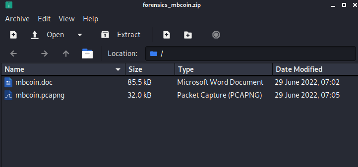

# Overview

> We have been actively monitoring the most extensive spear-phishing campaign in recent history for the last two months. This campaign abuses the current crypto market crash to target disappointed crypto owners. A company's SOC team detected and provided us with a malicious email and some network traffic assessed to be associated with a user opening the document. Analyze the supplied files and figure out what happened.

