# Overview
The Commercial machine was a challenge included in the HackTheBox Business CTF 2022 and was rated as hard difficulty.  The only information provided was the IP of the initial machine and the description below.

> We have identified a dark net market by indexing the web and searching for favicons that belong to similar marketplaces. You are tasked with breaking into this marketplace and taking it down.

# Initial Nmap Scan
The initial nmap scan below shows 4 ports open out of the top 1000 automatically scanned.  The banners tell us it is a Windows machine (though with OpenSSH running), but the services available are an odd combination either way.  The SSL cert information identified for the HTTPS service leaks the hostname of the box/IP/domain as commercial.htb.

```bash
$ sudo nmap -sC -sV 10.129.227.235 -v

Nmap scan report for commercial.htb (10.129.227.235)                                                                                                                                                                          [6/1341]
Host is up (0.084s latency).                                                                                       
Not shown: 996 filtered tcp ports (no-response)
PORT    STATE SERVICE    VERSION                      
22/tcp  open  ssh        OpenSSH for_Windows_8.1 (protocol 2.0)                                                                                                                                                                       
| ssh-hostkey: 
|   3072 ee:69:a0:e8:d7:43:6a:40:99:c6:16:0c:43:d3:d0:df (RSA)
|   256 73:95:19:f7:ac:36:3c:f9:78:6b:27:c6:b9:cb:c2:83 (ECDSA)                                                                                                                                                                       
|_  256 ec:2c:11:ab:ba:5e:30:4e:6d:b9:65:6b:ad:6d:39:e4 (ED25519)
135/tcp open  msrpc      Microsoft Windows RPC
443/tcp open  ssl/http   Microsoft HTTPAPI httpd 2.0 (SSDP/UPnP)
|_http-trane-info: Problem with XML parsing of /evox/about
| http-server-header: 
|   Microsoft-HTTPAPI/2.0
|_  Microsoft-IIS/10.0
| tls-alpn: 
|_  http/1.1
|_ssl-date: 2022-07-18T19:02:38+00:00; -1s from scanner time.
| ssl-cert: Subject: commonName=commercial.htb
| Subject Alternative Name: DNS:commercial.htb
| Issuer: commonName=commercial.htb
| Public Key type: rsa
| Public Key bits: 2048
| Signature Algorithm: sha256WithRSAEncryption
| Not valid before: 2022-07-10T21:15:25
| Not valid after:  2023-07-10T21:35:25
| MD5:   6aac 8f67 aa3e b943 6e94 987b ee75 ff91
|_SHA-1: c6fc 3014 4e1d d2d4 78c8 09e3 2c94 96b4 80c2 e2dd
| http-methods: 
|_  Supported Methods: GET HEAD
|_http-title: Monkey Store
|_http-favicon: Unknown favicon MD5: 0715D95B164104D2406FE35DC990AFDA
593/tcp open  ncacn_http Microsoft Windows RPC over HTTP 1.0
Service Info: OS: Windows; CPE: cpe:/o:microsoft:windows
```


# User Flag

## HTTPS
Visiting the IP in the browser returns an SSL error as the certificate appears to be for commercial.htb instead of the specific IP.


However, when accepting the risk and continuing we're presented with a 404 error that the page cannot be found.  This appears to be due to the server expecting the name commercial.htb specifically rather than the IP address.  After updating my /etc/hosts file to point the IP to commercial.htb and reloading the page, it loads successfully and we're given the home page for "Monkey Store".

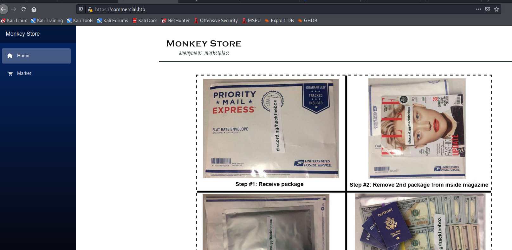

The message below is included on the page mentioning that all links were taken down previously and some functionality is still down.  This is confirmed when clicking around the home/market pages where nothing seems to be interactive and there is no way to add items to a cart or login (though I haven't brute-forced directories/page at this point).

```default
Update 15-07-2022:

We are back up and running. The old link was unfortunately
seized and taken down by ??????. Parts of this website are
still under development. Registrations are currently down.
Only our most trusted vendors and customers can access the
store. The issue will be resolved very soon. A lot of exit
nodes are being taken down by ??????. Be vigilant.
~ MB

Update 16-03-2020:

Error........We are deleting all of the available listings.
Not for ever.  Until it is safe for our vendors and buyers.
It is very vital that you stay away from this market place.
Going away for some time. They are close. Hide your tracks.
Most of our servers have been taken down. This is the last.
Above all do not access the City Market. It is compromised.
~ MB
```

Normally, I would move on to attempting to brute force directories with gobuster or investigating the web app further, but in this case I noticed a considerable amount of files being loaded in the Firefox DevTools whenever a page was requested.  The vast majority appear to be initiated by the file blazor.webassembly.js.  [Blazor](https://dotnet.microsoft.com/en-us/apps/aspnet/web-apps/blazor) itself is a C# framework that is used to build interactive web apps with .NET.

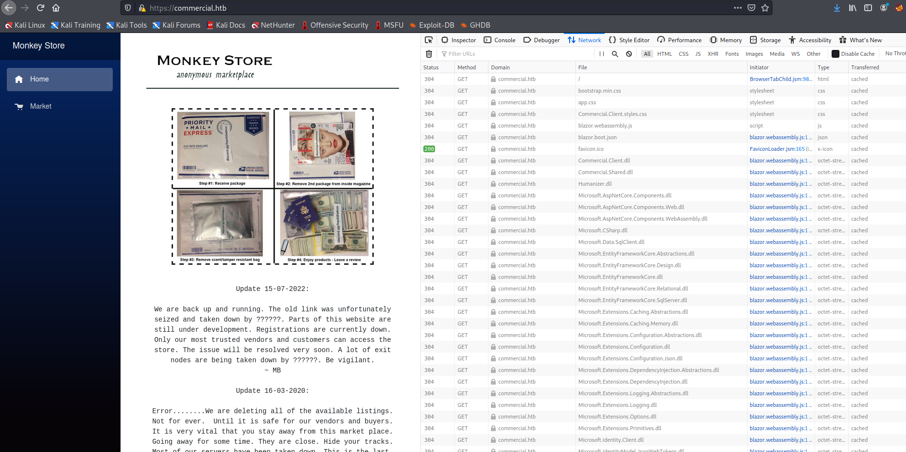

In my research, I found [this video](https://www.youtube.com/watch?v=Xx1eMlscXrQ) below that discusses how Blazor WebAssembly applications can be exploited if the project's DLLs are visible when the application loads (as seen above).  As we can see the list of DLLs loaded by the app, we can download any of them individually and inspect them with an application like DNSpy or ILSpy that will allow the .NET code to be decompiled.  Many of the DLLs appear to be related to Microsoft packages, but "Commercial.Client.dll" and "Commercial.Shared.dll" appear to be associated with the specific project, so those are our first target.


## Decompiling Blazor DLLs
I downloaded both files mentioned above and opened then in the [DNSpy](https://github.com/dnSpy/dnSpy) application which, as seen below, was able to successfully open them.  I began with "Commercial.Shared.dll" for no particular reason, but it ended up being the more interesting file either way.

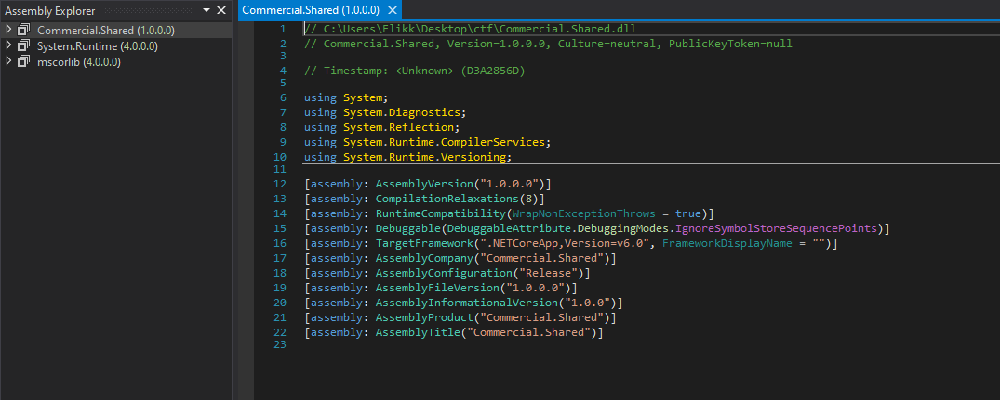

Drilling down into the runspace and functions of the application reveals hardcoded credentials for the user Timothy.Price that appears to be used in a SQL connection string included for the application to function.

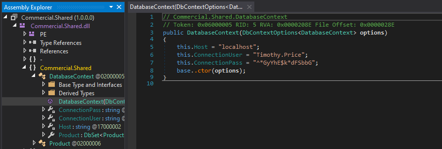

Using these credentials against the SSH service that was identified in the initial scan successfully logs us in as timothy.price and shows us the hostname of this machine is CMF-WKS001.


The user.txt flag can then be found on this user's desktop.

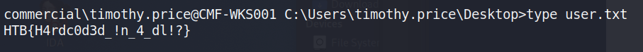

# Privilege Escalation to Richard.Cartwright
Before moving any further, I ran ipconfig to get an idea of our network interfaces and the only active one we're shown is for the IP 172.16.22.2, which means there is a NAT involved somewhere that routes the 10.x.x.x address we originally used to this host. 


## Event Log Reader Group
Checking the user's permissions shows he is a member of the "Event Log Readers" group, which is non-standard that allows the group members read access to any event log.

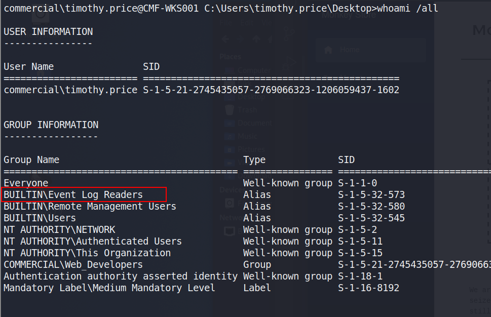

Initial checks using PowerShell show there are 7 different logs we can read, though only 3 appear to have data available.  Windows PowerShell specifically sounds interesting as a first place to check.

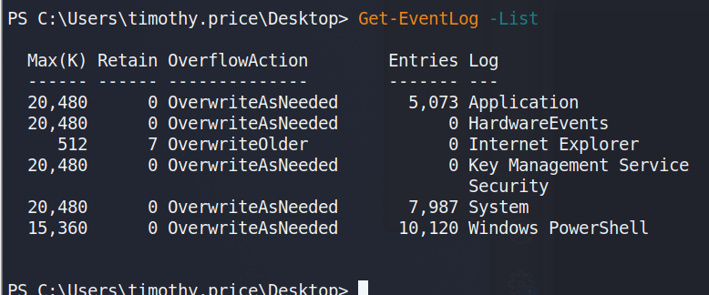

From here, I used the command below to enumerate the PowerShell logs, which was a little tedious as it retrieves every log in this category, but one stood out eventually when scrolling through as including a base64-encoded command.

```powershell
Get-EventLog -LogName "Windows PowerShell"
```

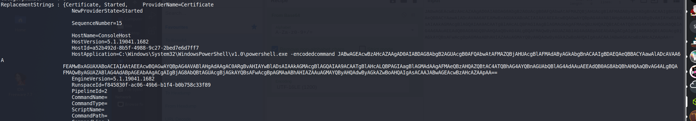

This encoded PowerShell commands decodes into the command below, which includes credentials for the user richard.cartwright.

```powershell
$passwd = ConvertTo-SecureString "CDyA&k%7T:Q3qe\h" -AsPlainText -Force; $cred = New-Object System.Management.Automation.PSCredential ("commercial\richard.cartwright", $passwd)
```

Moving back to SSH again, we're able to successfully log in as richard.cartwright with these new credentials.

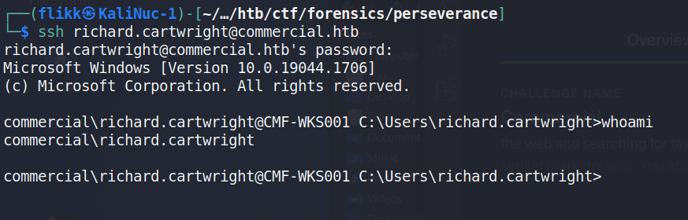


# 2nd Privilege Escalation to Local Admin
Unfortunately, Richard doesn't seem to have anything very interesting in his home directory.  Checking this user's permissions, we can see he is a member of a custom domain group named "IT_Staff".


At this point, Bloodhound could be run to gather domain information and plot out the same attack path I'm going to use, but I had some trouble with my SSH session not running Bloodhound correctly in PowerShell and the executable being detected by Windows Defender.  I didn't feel like putting a lot of effort into obfuscating the script past changing function names, so I moved on to using [PowerView](https://github.com/PowerShellMafia/PowerSploit/blob/master/Recon/PowerView.ps1) instead for domain recon.  Below I'm retrieving the script from my machine and running the `Get-Domain` command to confirm the script was loaded correctly.

> **NOTE**: Before I load any script into a PowerShell session I am running an AMSI bypass to ensure the scripts function correctly without Defender/AMSI stopping them.  There are various bypasses found around the internet with a good collection at https://amsi.fail/, though several at this site are detected as malicious nowadays if used as is.

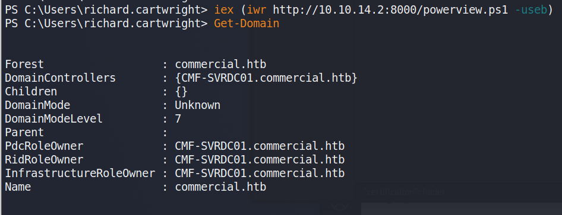

Using powerview to investigate this "IT_Staff" group, we can see Richard is the only member.

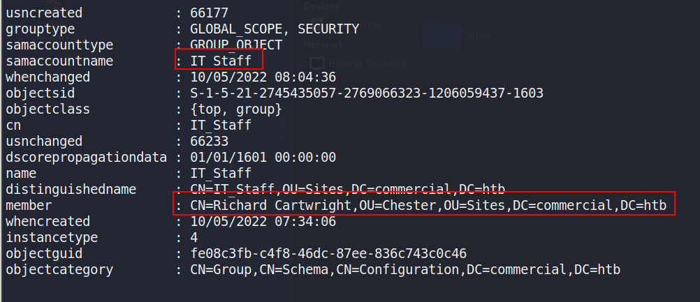

This doesn't necessarily give us much more information on what the group can do so I ran the script [PrivEscCheck.ps1](https://github.com/itm4n/PrivescCheck) to perform a variety of checks for local misconfigurations that would allow us to elevate privileges locally, if not in the domain.  This script performs many of the same checks as tools like [SeatBelt](https://github.com/GhostPack/Seatbelt) and [PowerUp](https://github.com/PowerShellMafia/PowerSploit/blob/master/Privesc/PowerUp.ps1).

```powershell
Invoke-PrivescCheck -Report check -Force html -Extended
```

The command above outputs the results to an HTML file that can be downloaded from the machine for easier reference, but I noticed during the execution that one check showed [LAPS](https://www.varonis.com/blog/microsoft-laps) (Local Administrator Password Solution) was enabled on this machine.

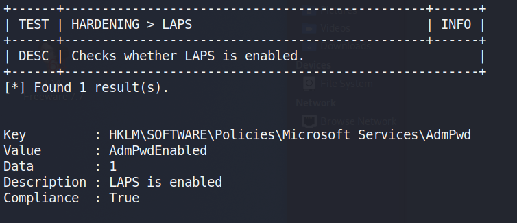

With LAPS enabled, we can use the [LAPSToolkit](https://github.com/leoloobeek/LAPSToolkit) to help identify which groups/users potentially have access to read the LAPS password.

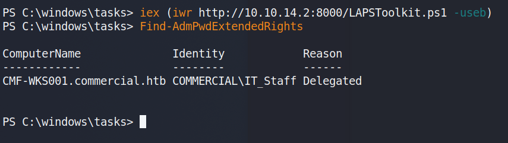

As seen in the image above, the IT_Staff group we are a member of happens to have permission to read the LAPS passwords.  The same LAPSToolkit script can then be used to retrieve any LAPS passwords set for machines in the domain.  This gives us the administrator password for the CMF-WKS001 machine, which is what we're currently working on.  This also shows us there are two other computers in the commercial.htb domain, one of which appears to be the domain controller.

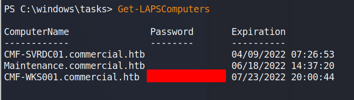

Taking this password and going back to SSH one more time shows the credentials are valid and allow us to log in as the local administrator of the machine.

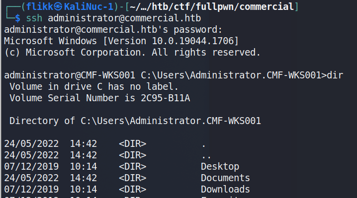

# Accessing the Domain Controller
However, though there are multiple users and home directories on the machine, there is no root flag to be found.  In this case, given there are multiple machines in the domain, the root flag is likely on the domain controller seen earlier in our enumeration.  I used Metasploit to help make post-exploitation easier and opted for the `multi/script/web_delivery` module to deliver the initial payload through a PowerShell command using the configuration below.

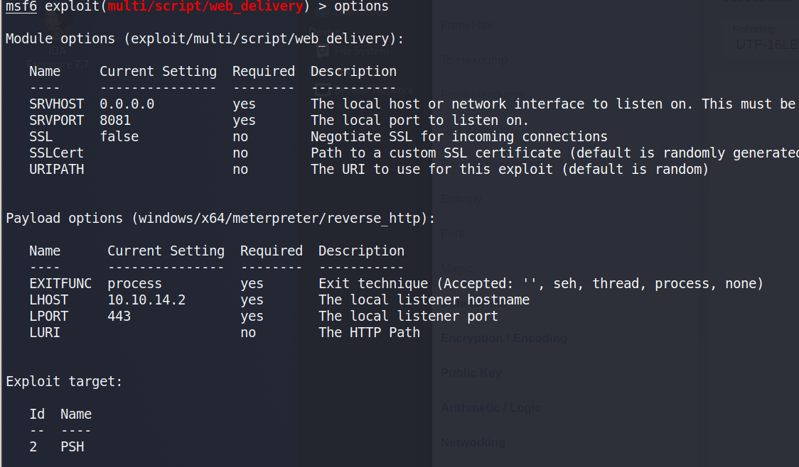

After it is run, this module starts a web server and produces a PowerShell command to be run on the target that will call back and retrieve the stager for the meterpreter payload.  Running this command in our SSH session as the local administrator successfully gives us a new session in Metasploit.

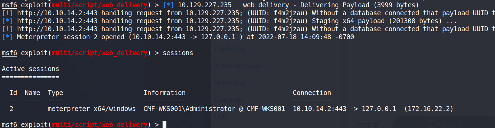

As we're the local administrator, we should have the appropriate access to dump credentials from the device.  `hashdump` can be used to dump the local SAM database, but we want to gather domain credentials as well so I chose the kiwi module which just includes functionality from Mimikatz.  The commands below will elevate our session from administrator to SYSTEM and then load the kiwi module.

```bash
# Elevate admin session to NT Authority\SYSTEM.  This may fail due to AV detection
meterpreter > getsystem
# Load the kiwi module for dumping credentials
meterpreter > load kiwi
```

Finally, the `creds_all` command can be used to dump all available credentials from the device, domain and otherwise.  As seen below, this includes the hash for the Administrator account for the commercial.htb domain, which is by default a domain admin.


Now that we have a domain admin's NTLM hash, we could potentially use it to access the domain controller identified earlier.  The problem is that device is not reachable from our "public" IP, only from the internal subnet the workstation is on.  There are several ways to solve this, but I chose to continue with Metasploit and use its routing/proxy functionality to tunnel traffic from my system through the active meterpreter session.

```bash
# Add a route in metasploit to direct any traffic to the 172.16.22.0/24 subnet through the active session
route add 172.16.22.0/24 <session ID>
# Start the socks_proxy module to allow proxychains to redirect traffic to the session
use auxiliary/server/socks_proxy
run -j
```

With the route and proxy running in Metasploit, [proxychains](https://github.com/haad/proxychains) can be used to route the traffic of normal Linux tools through the current meterpreter session.  The configuration file at /etc/proxychains.conf (or /etc/proxychains4.conf) may need to be modified to match the port used in the socks_proxy module, but mine are both currently using port 1080.

By prepending `proxychains` to the impacket-wmiexec command, the traffic will be sent through the metasploit session and to the domain controller successfully.  As we are able to reach the domain controller and have valid credentials for the domain administrator account, this provides us with a semi-interactive shell on CMD-SRVDC01.

> **NOTE**: Other impacket tools like psexec or smbexec could also be used for this step, but I've found them more likely to be detected and stopped by AV for some reason.

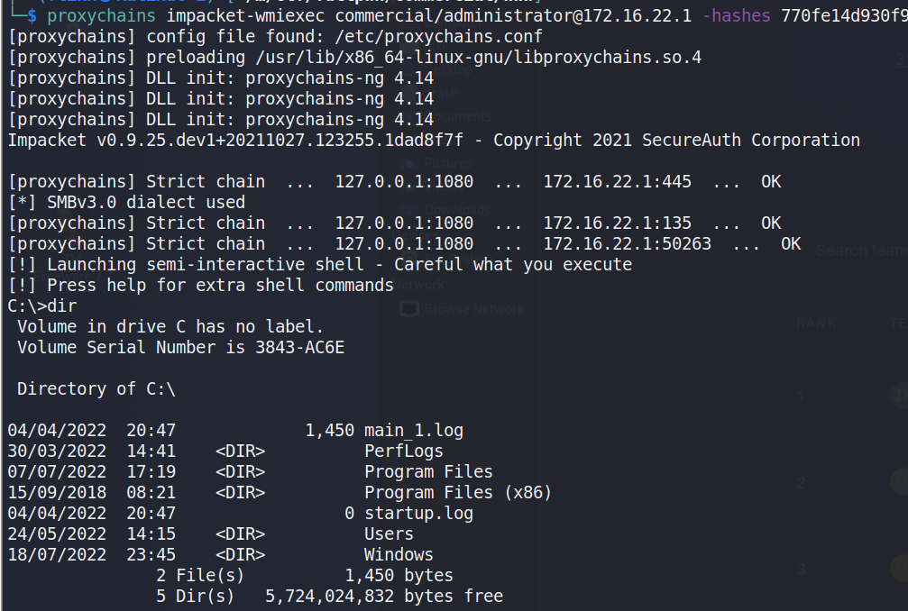

Using this shell to navigate to the administrator's desktop finds the root.txt file and the 2nd flag.

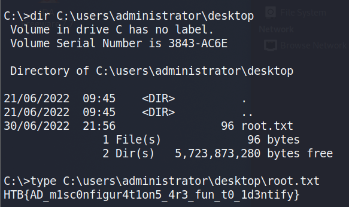